# bank_application

## Thông tin đăng nhập

| Trụ sở      | Tên tài khoản | Mật khẩu   |
|-----------------|---------------|------------|
| **TPHCM**       | longbott        | Long123.  |

## Giao diện (Interface)

### Đăng nhập

  
  <b>Đăng nhập</b>

  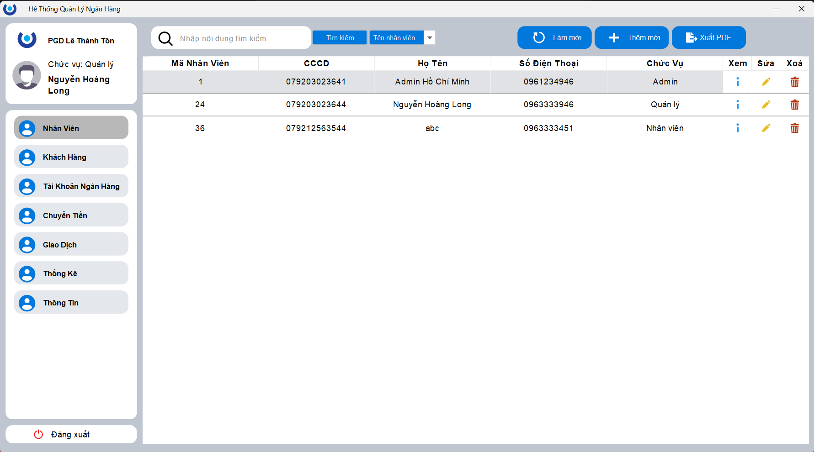
  <b>Nhân viên</b>

  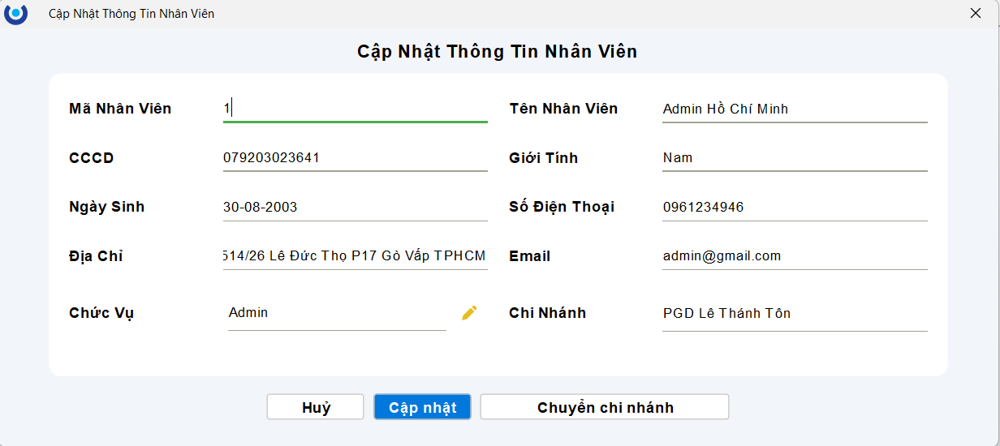
  <b>Chi tiết thông tin nhân viên</b>

  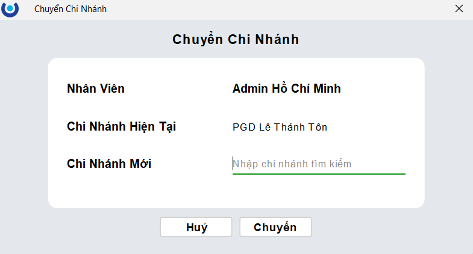
  <b>Chuyển chi nhánh</b>

  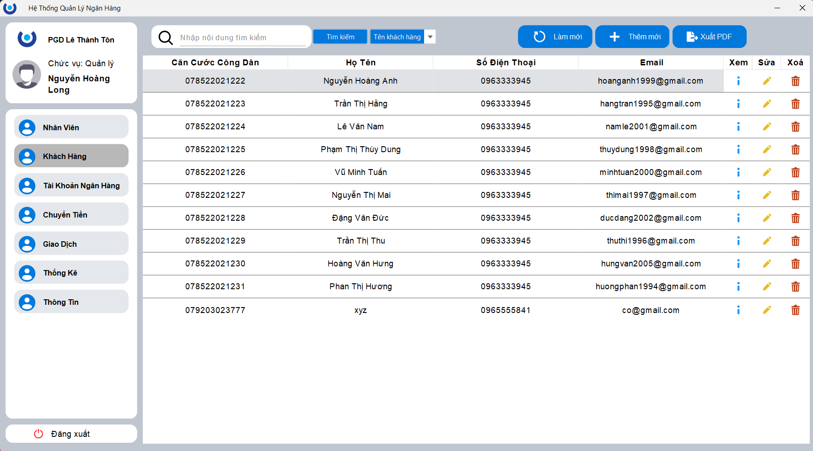
  <b>Quản lý khách hàng</b>

  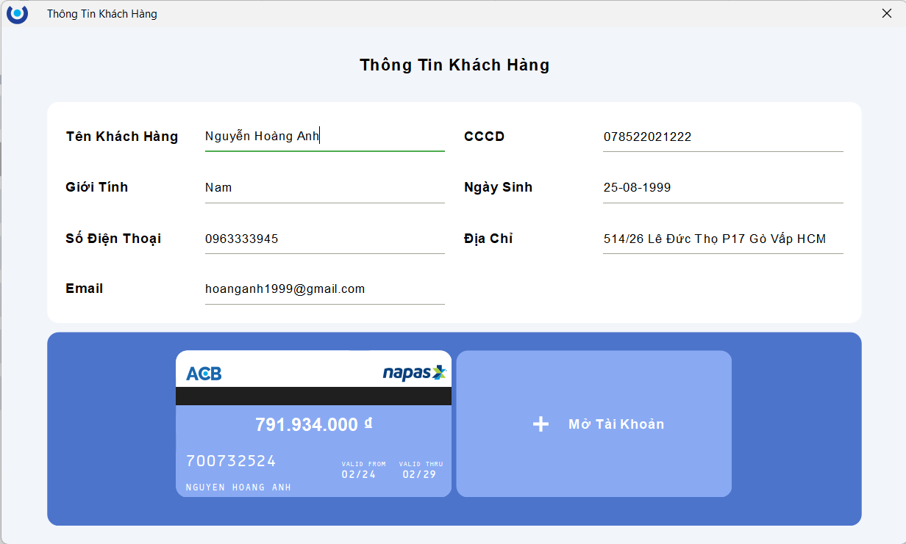
  <b>Thông tin chi tiết khách hàng</b>

  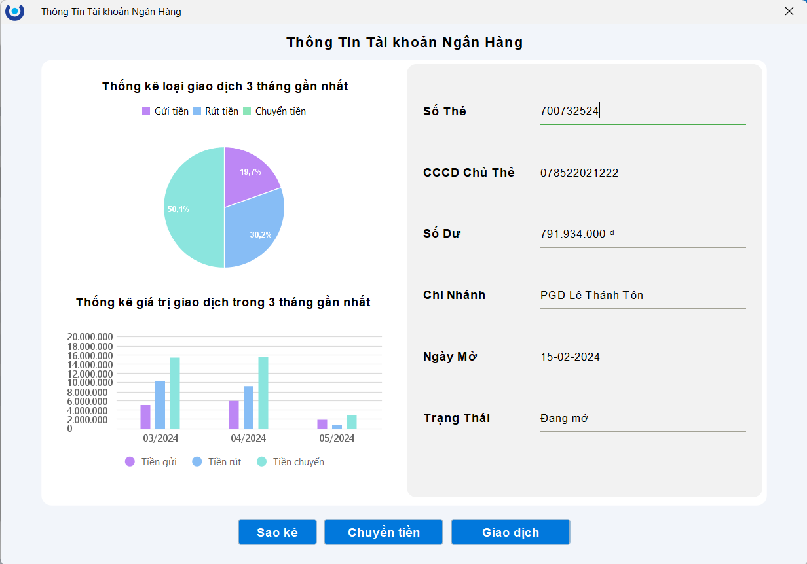
  <b>Thông tin chi tiết tài khoản khách hàng</b>

  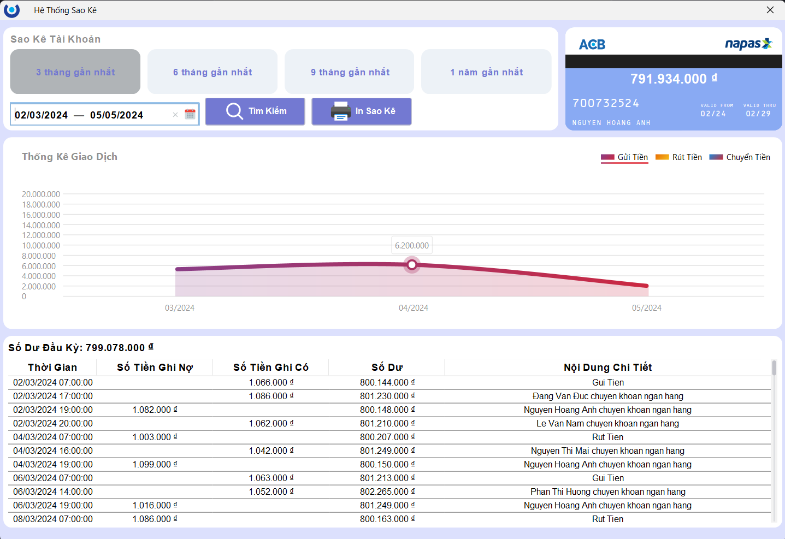
  <b>Sao kê</b>

  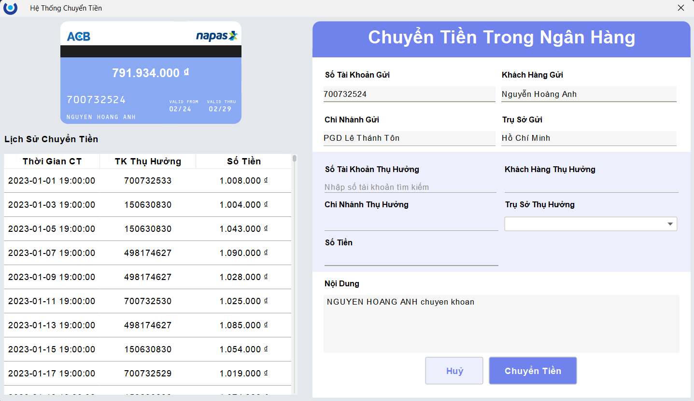
  <b>Chuyển tiền</b>

  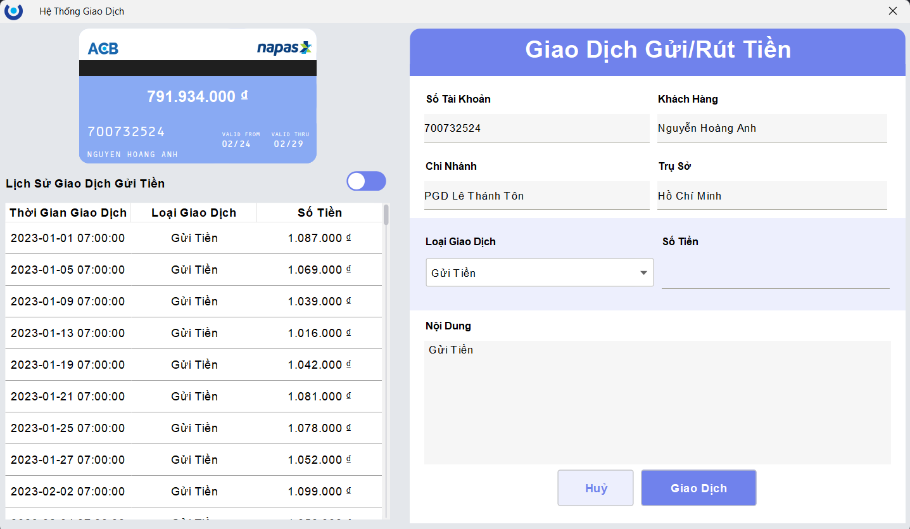
  <b>Giao dịch</b>

  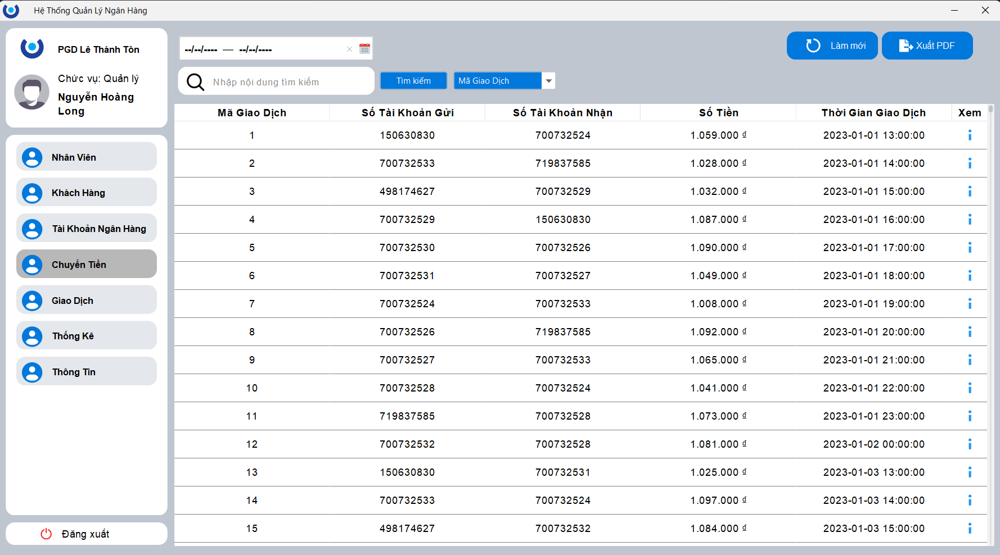
  <b>Danh sách giao dịch chuyển tiền</b>

  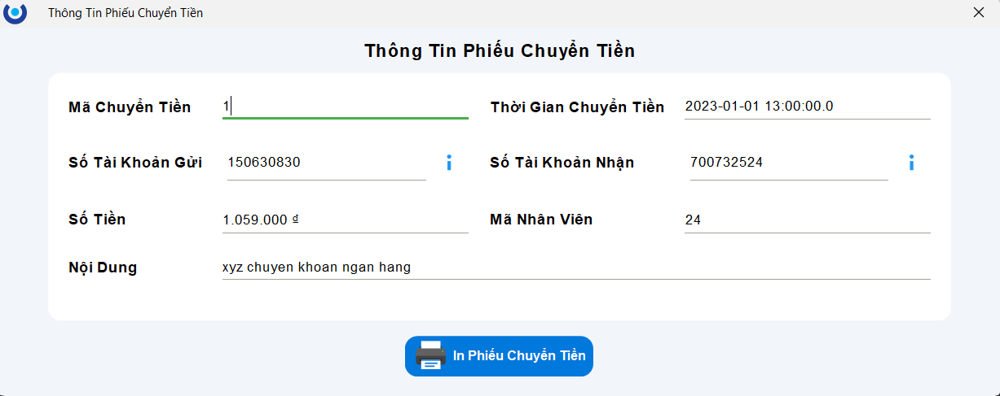
  <b>Thông tin chi tiết phiếu chuyển tiền</b>

  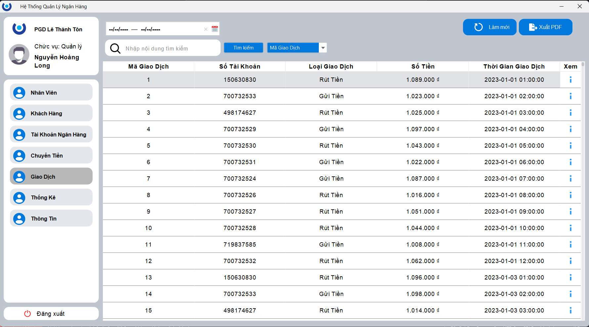
  <b>Danh sách giao dịch gửi/rút tiền</b>

  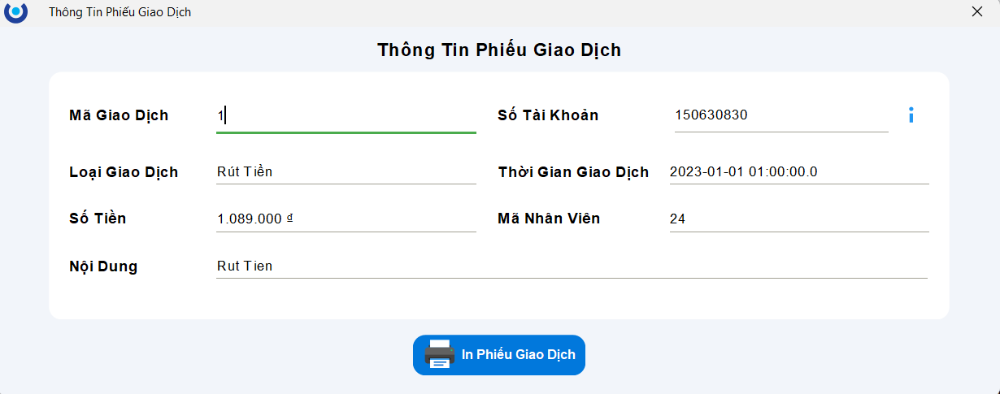
  <b>Thông tin chi tiết phiếu giao dịch gửi/rút tiền</b>

  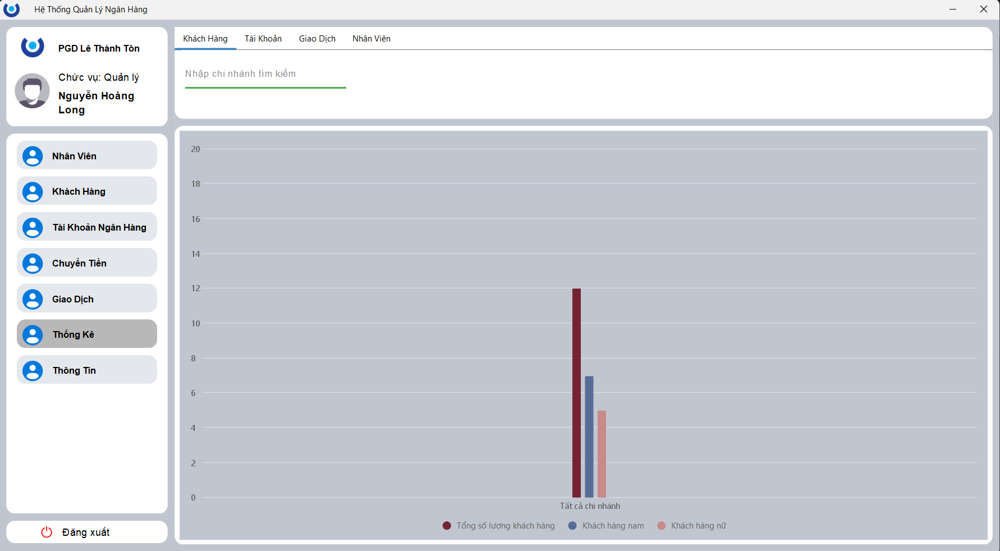
  <b>Thống kê khách hàng</b>

  
  <b>Thống kê tài khoản</b>

  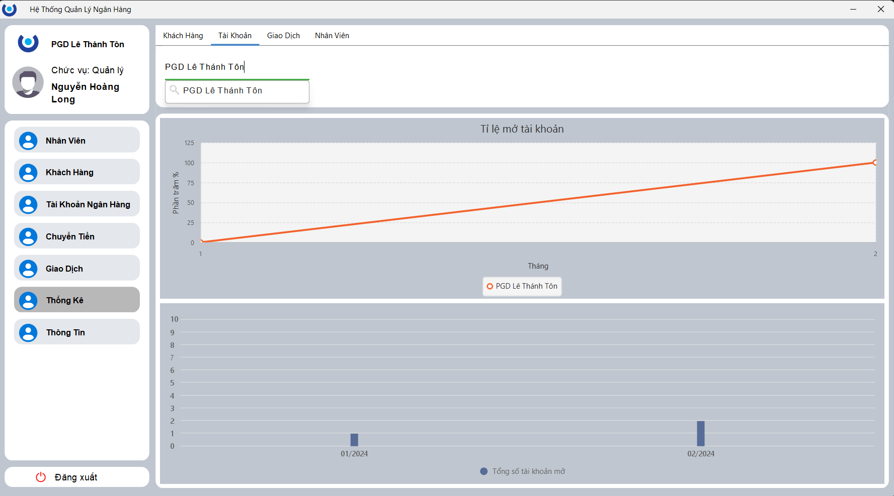
  <b>Thống kê giao dịch</b>

  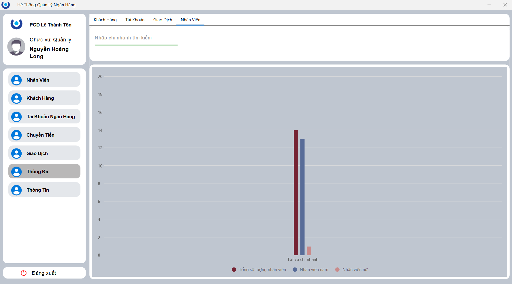
  <b>Thống kê nhân viên</b>

